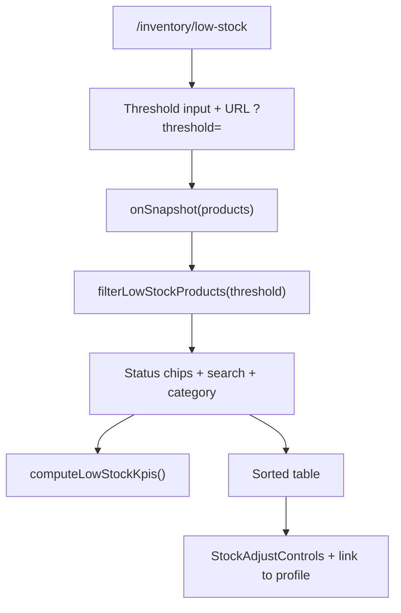

# Low Stock & Reorder Alerts — Feature Plan

## Overview

Add a dedicated admin page where the owner can set a **configurable stock threshold** (e.g. 5, 10, 20) and see all products at or below that level. Today, low-stock logic exists only on the dashboard with a **hardcoded threshold of 5** and a minimal two-column table (name + stock).

This document is the implementation contract for the feature. **Phase 1** is the first deliverable; later phases are scoped but not scheduled.

**Related code today:**

| Area | Path |
|------|------|
| Hardcoded threshold | [`lib/inventory/stockSummary.ts`](../../lib/inventory/stockSummary.ts) — `LOW_STOCK_THRESHOLD = 5` |
| Dashboard UI | [`app/components/dashboard/StockSummary.tsx`](../../app/components/dashboard/StockSummary.tsx) |
| Product list (patterns to reuse) | [`app/components/products/ProductList.tsx`](../../app/components/products/ProductList.tsx) |
| Filter patterns | [`app/components/pricing/PricingFilters.tsx`](../../app/components/pricing/PricingFilters.tsx) |
| Stock mutations | [`lib/firestore/inventory.ts`](../../lib/firestore/inventory.ts) — `stockIn` / `stockOut` |
| Nav | [`lib/navigation.ts`](../../lib/navigation.ts) |

---

## Goals

1. **Configurable threshold** — Enter any non-negative integer; the list updates immediately (5 shows stock ≤ 5, 10 shows stock ≤ 10, etc.).
2. **Actionable list** — Enough context (category, prices, value) to decide what to reorder without leaving the page.
3. **Real-time data** — Match existing product pages: live Firestore `onSnapshot`, not one-shot loads.
4. **Consistent UX** — Same layout shell (`PageHeader`, `Card`, table styling) as Products, Pricing, and Discard stock.

## Non-goals (for now)

- Per-product reorder thresholds (schema change) — Phase 3
- Email/WhatsApp alerts — Phase 3
- Bulk multi-product stock-in — Phase 3
- Per-product sales velocity / days-of-stock — Phase 3

---

## Route & navigation

| Item | Value |
|------|-------|
| Route | `/inventory/low-stock` |
| Nav label | **Low stock** |
| Placement | After **Discard stock** in admin nav |
| Access | Admin only (`AdminOnly` wrapper, same as Pricing & margin) |
| URL param | `?threshold=10` — optional; pre-fills threshold on load |

Update [`lib/navigation.ts`](../../lib/navigation.ts):

```ts
{ href: "/inventory/low-stock", label: "Low stock", roles: ["admin"] },
```

---

## Data model (no schema changes in Phase 1)

Stock lives on `products.stock_quantity` ([`ProductDoc`](../../lib/types/firestore.ts)). There is **no SKU field**; document ID is the product identifier.

| Field | Use on page |
|-------|-------------|
| `name` | Display + search |
| `category` | Display + filter |
| `stock_quantity` | Threshold filter, sort, badges |
| `cost_price` | Stock value at cost |
| `sale_price` | Display |
| `image_url` | Optional thumbnail (Phase 2) |

FIFO detail is in `stock_lots` — not required for Phase 1.

### Filter semantics

| Condition | Label |
|-----------|-------|
| `stock_quantity <= threshold` | Low stock (default view) |
| `stock_quantity === 0` | Out of stock |
| `0 < stock_quantity <= threshold` | Need reorder |

**Default sort:** `stock_quantity` ascending (most urgent first).

**Default threshold:** `5` — matches existing `LOW_STOCK_THRESHOLD` so dashboard and page stay aligned until the user changes it.

---

## Architecture



### Data loading

- **Client component** with `onSnapshot` on `products` collection (same pattern as [`ProductList`](../../app/components/products/ProductList.tsx)).
- Filter, sort, and KPI aggregation run **client-side** after each snapshot.
- Rationale: Dashboard already scans all products via `getDocs`; product count is small enough for a full collection listener. No new Firestore indexes or API routes.

### Shared logic extraction

Refactor threshold filtering out of the hardcoded constant where practical:

| Module | Responsibility |
|--------|----------------|
| `lib/inventory/lowStock.ts` | `filterLowStockProducts`, `computeLowStockKpis`, types, default threshold |
| `lib/inventory/stockSummary.ts` | Keep `LOW_STOCK_THRESHOLD = 5` for dashboard; optionally call shared helpers |

```ts
// lib/inventory/lowStock.ts (planned API)

export const DEFAULT_LOW_STOCK_THRESHOLD = 5;

export type LowStockStatus = "out_of_stock" | "need_reorder" | "low_stock";

export type LowStockProductRow = {
  id: string;
  name: string;
  category: string | null;
  stock_quantity: number;
  cost_price: number;
  sale_price: number;
  stockValueAtCost: number;
  status: LowStockStatus;
};

export type LowStockKpis = {
  matchingCount: number;
  outOfStockCount: number;
  reorderCount: number;
  totalUnitsAtRisk: number;
  totalValueAtCost: number;
};

export function filterLowStockProducts(
  products: LowStockProductRow[],
  threshold: number,
  opts?: { status?: LowStockStatus | "all" },
): LowStockProductRow[];

export function computeLowStockKpis(
  rows: LowStockProductRow[],
): LowStockKpis;
```

---

## UI specification

### Page shell

```
app/(dashboard)/inventory/low-stock/page.tsx
```

```tsx
<AdminOnly>
  <div className="space-y-10">
    <PageHeader title="..." description="..." />
    <LowStockPageContent />
  </div>
</AdminOnly>
```

### Layout sections (top to bottom)

#### 1. Controls card

| Control | Behavior |
|---------|----------|
| Threshold input | `type="number"`, `min={0}`, integer; debounce not required |
| Preset chips | `0` (out of stock only), `5`, `10`, `20` — set threshold on click |
| Search | Filter by name or category (case-insensitive) |
| Category select | `All` + distinct categories from loaded products |
| Status chips | All low stock · Out of stock · Need reorder |

Show hint: *"Showing N products with stock ≤ {threshold}"*.

#### 2. KPI summary row

| Card | Computation |
|------|-------------|
| Matching products | `matchingCount` |
| Out of stock | `outOfStockCount` |
| Need reorder | `reorderCount` |
| Units at risk | `totalUnitsAtRisk` |
| Value at cost | `totalValueAtCost` (format with existing `formatMoney`) |

Use the same stat card / muted border style as dashboard `StockSummary` and pricing summary cards.

#### 3. Product table

| Column | Notes |
|--------|-------|
| Product | Name linked to `/products/[id]` |
| Category | `—` if empty |
| Stock | `tabular-nums`; color: red if 0, amber if ≤ threshold |
| Cost | `formatMoney(cost_price)` |
| Sale | `formatMoney(sale_price)` |
| Value at cost | `stock × cost_price` |
| Status | Badge: Out of stock / Need reorder |
| Actions | `StockAdjustControls` (reuse from ProductList) |

**Empty states:**

- No products in DB → "No products yet."
- None below threshold → "No products at or below {threshold} units."
- Search/filter no match → "No products match your filters."

**Loading / error:** Same patterns as `ProductList` (`role="status"`, `InlineAlert`).

---

## File checklist

### Phase 1 — create

| File | Purpose |
|------|---------|
| `docs/inventory/LOW_STOCK_PAGE_PLAN.md` | This document |
| `lib/inventory/lowStock.ts` | Pure filter/KPI helpers + types |
| `app/(dashboard)/inventory/low-stock/page.tsx` | Route + `AdminOnly` + `PageHeader` |
| `app/components/inventory/LowStockPageContent.tsx` | Client page: snapshot, filters, KPIs, table |

### Phase 1 — modify

| File | Change |
|------|--------|
| `lib/navigation.ts` | Add nav item for `/inventory/low-stock` |

### Phase 1 — optional (small polish)

| File | Change |
|------|--------|
| `app/components/dashboard/StockSummary.tsx` | "View all" link → `/inventory/low-stock?threshold=5` |
| `lib/inventory/stockSummary.ts` | Import `DEFAULT_LOW_STOCK_THRESHOLD` from `lowStock.ts` to avoid duplicate magic numbers |

### Phase 2+ (not Phase 1)

| File | Purpose |
|------|---------|
| `lib/inventory/lowStockExport.ts` | CSV export |
| `lib/pdf/lowStockReorderPdf.ts` | Print/PDF reorder list |
| `lib/firestore/stockLotsQuery.ts` | Last stock-in date per product |

---

## Phase breakdown

### Phase 1 — MVP (implement next)

**Objective:** Configurable threshold page with KPIs, filters, and actionable table.

**Tasks:**

1. Add `lib/inventory/lowStock.ts` with filter/KPI helpers and unit-testable pure functions.
2. Add `LowStockPageContent` — `onSnapshot`, threshold state (init from URL `?threshold=` or default 5), filters, table.
3. Add route `app/(dashboard)/inventory/low-stock/page.tsx`.
4. Add nav entry in `lib/navigation.ts`.
5. Reuse `StockAdjustControls` and product profile links in table rows.
6. Manual smoke test (see Test plan below).

**Acceptance criteria:**

- [ ] Nav shows "Low stock" for admin users.
- [ ] Threshold `5` lists all products with `stock_quantity <= 5`.
- [ ] Threshold `10` lists all products with `stock_quantity <= 10` (superset of 5).
- [ ] Preset chips and manual input both update the list without page reload.
- [ ] KPI cards reflect the filtered set (not entire catalog).
- [ ] Search and category filter work together with threshold.
- [ ] Status chips: Out of stock / Need reorder narrow the list correctly.
- [ ] Table sorted by stock ascending by default.
- [ ] Stock in/out from row controls updates the list in real time.
- [ ] Clerk users cannot access the page (redirect via `AdminOnly`).

---

### Phase 2 — Operational extras

**Objective:** Make the page useful for supplier orders and warehouse runs.

| # | Feature | Detail |
|---|---------|--------|
| 1 | Suggested reorder qty | Column: `max(threshold - stock, 0)`; footer total |
| 2 | Export CSV | Download filtered list (name, category, stock, suggested qty, cost, value) |
| 3 | Print / PDF | Reorder list for offline use (jsPDF, same stack as invoices) |
| 4 | Dashboard link | `StockSummary` → "View all" with `?threshold=5` |
| 5 | Persist threshold | `localStorage` key `lowStock.threshold` (or Firestore `settings` later) |
| 6 | Product image thumbnail | Small image in table if `image_url` present |

**Acceptance criteria:**

- [ ] Export reflects current filters, not full catalog.
- [ ] Suggested qty total updates when threshold changes.
- [ ] Dashboard link opens page with matching threshold.

---

### Phase 3 — Advanced (future)

| # | Feature | Notes |
|---|---------|-------|
| 1 | Per-product `reorder_threshold` | `ProductDoc` field; migration default = global threshold |
| 2 | Last stock-in date | From latest `stock_lots.received_at` per product |
| 3 | Days-of-stock / velocity | Per-product sell rate from recent invoices; prioritize by runway |
| 4 | Bulk stock-in | Multi-select rows → single restock flow |
| 5 | Alerts | Notify when `matchingCount` exceeds N or specific SKU hits 0 |
| 6 | Shared settings doc | `settings/inventory` with `default_low_stock_threshold` for all admins |

---

## Test plan (Phase 1)

### Manual

1. Log in as admin → open **Low stock** from sidebar.
2. With seed data, set threshold **5** → verify count matches dashboard low-stock table.
3. Change to **10** → list grows (includes everything from step 2).
4. Set **0** or use Out of stock chip → only `stock_quantity === 0`.
5. Search partial product name → list narrows; clear search → restores.
6. Pick a category → only that category below threshold.
7. Use **Stock in** on a row → stock increases; row may disappear if now above threshold.
8. Log in as clerk → confirm page is not accessible.

### Unit tests (recommended for `lib/inventory/lowStock.ts`)

- `filterLowStockProducts` with threshold 5, 10, 0
- Status filter: out_of_stock vs need_reorder
- `computeLowStockKpis` totals
- Edge: empty array, threshold 0, negative input clamped to 0

---

## Open questions

| Question | Recommendation |
|----------|----------------|
| Route: `/inventory/low-stock` vs `/products/low-stock`? | **`/inventory/low-stock`** — groups with Discard stock under inventory |
| Include products with stock exactly at threshold? | **Yes** — `<= threshold` (matches existing `stockSummary` behavior) |
| Should dashboard threshold become configurable too? | Not in Phase 1; link to new page is enough |
| Clerk access? | **No** — admin-only, same as Pricing |

---

## Implementation order (Phase 1 checklist)

Use this as the step-by-step guide when coding:

1. [ ] `lib/inventory/lowStock.ts` — types, filter, KPIs, `DEFAULT_LOW_STOCK_THRESHOLD`
2. [ ] `app/components/inventory/LowStockPageContent.tsx` — full client UI
3. [ ] `app/(dashboard)/inventory/low-stock/page.tsx` — page shell
4. [ ] `lib/navigation.ts` — nav item
5. [ ] Manual test pass
6. [ ] (Optional) Dashboard "View all" link
7. [ ] (Optional) Align `LOW_STOCK_THRESHOLD` with `DEFAULT_LOW_STOCK_THRESHOLD`

---

## Revision history

| Date | Change |
|------|--------|
| 2026-06-09 | Initial plan — Phases 1–3 scoped; Phase 1 ready for implementation |
